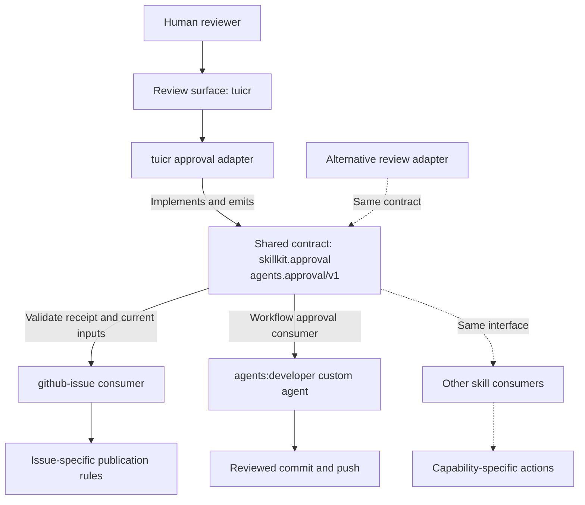

# Architecture

## Package layout

The repository uses [Agent Plugins 1.0.0](https://agent-plugins.org/specification).
The schema identifier in [`plugin.json`](../plugin.json) pins the package format
to exactly `1.0.0`; the manifest's `version` tracks plugin releases separately.

| Path | Responsibility |
| --- | --- |
| `plugin.json` | Plugin manifest and Copilot extension registration |
| `mcp.json` | Official GitHub MCP endpoint, scoped to `repos,issues` |
| `skills/<name>/SKILL.md` | Discoverable skill contract and activation description |
| `skills/_lib/skillkit/` | Shared Python primitives for processes, paths, Git, tmux, and review sessions |
| `com.github.copilot/agents/` | Copilot CLI custom agents that compose skills into workflows |
| `tests/` | Repository regression and package-discovery harnesses |

## Design criteria

**Copilot CLI is the supported client.** Installation and runtime behavior are
designed for it; cross-client compatibility is not tested or maintained. Custom
agents use the `com.github.copilot` reverse-domain extension namespace because
Agent Plugins 1.0.0 does not define a core custom-agent component.

**Skills own capabilities; agents own orchestration.** Each skill is standalone
and must not depend on another skill's implementation. Custom agents compose
skills and own cross-capability workflow policy.

**Prefer executable processes to procedural prose.** Python scripts implement
repeatable behavior; documentation explains intent, interfaces, and constraints.
Reuse shared primitives in [`skillkit`](../skills/_lib/README.md) rather than
duplicating platform-specific logic.

**Keep guardrails focused.** Require restrictions needed for safety and
correctness; otherwise preserve agent flexibility and judgment. Local review
workflows keep human approval explicit, with staging, commits, and remote
publication outside the tuicr watch loop.

See [CI and validation](CI.md) for the checks covering these surfaces.

## Generic review approval

The review surface and approval gate are provider-independent software
interfaces. A capability exposes its inputs as files on the review surface and
waits for approval. [`skillkit.approval`](../skills/_lib/skillkit/approval.py)
defines the versioned `agents.approval/v1` receipt: approval status, workspace,
`HEAD`, and relative file paths with SHA-256 content fingerprints. It validates
the receipt and verifies current inputs. It carries no skill-specific fields.

tuicr is the current adapter. Its close report includes the generic receipt in
`approval`; the invoking workflow passes that receipt, not the tool-specific
report, to consuming skills. A replacement adapter can emit the same receipt
without changing those skills.

Solid arrows show the current implementation; dashed arrows show extension
points, not additional implemented adapters or consumers.
`agents:developer` consumes approval through its workflow gates; `github-issue`
uses the typed receipt validation API.

After approval, the consuming skill verifies its own current files and applies
its own publication rules. For GitHub issues, both `draft.md` and `metadata.json`
must be reviewed and unchanged. The target repository and issue metadata come
from that reviewed `metadata.json`, not fields added to the tuicr report.

Only explicitly registered questions to the human block approval. Questions
and answers are linked by comment ID; editing either invalidates resolution.
Agent comments carry model IDs in tuicr's persisted `author` field; authorless
comments count as human answers. This is a local identity convention, not
cryptographic authentication. `description` and `review-note` are orientation,
never approval blockers.
